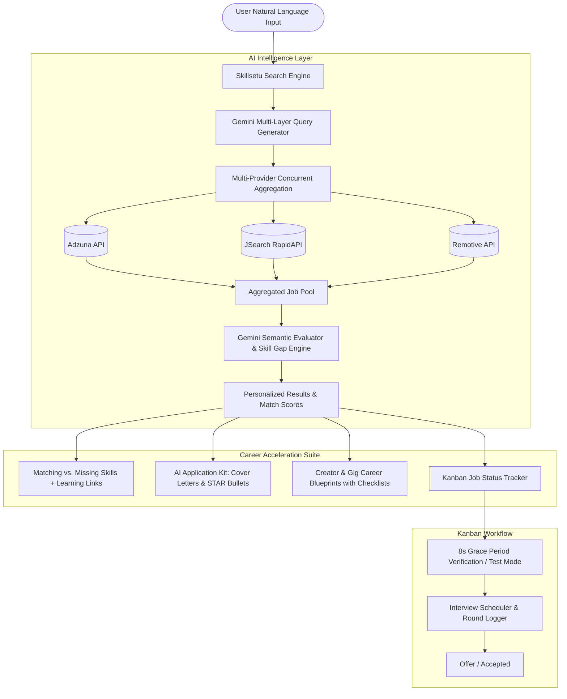

# Skillsetu ⚡

> **Turn your skills into your next opportunity.**  
> An AI-powered Career Intelligence Platform featuring real-time multi-provider job aggregation, semantic skill-gap analysis, creator career roadmaps, and full-lifecycle Kanban application tracking.

[](https://nextjs.org/)
[](https://react.dev/)
[](https://tailwindcss.com/)
[](https://ai.google.dev/)
[](LICENSE)

---

## 🎯 What is Skillsetu?

Traditional job boards rely on rigid title searches and keyword filters that fail career switchers, multidisciplinary creators, and gig professionals.

**Skillsetu transforms raw user capabilities into concrete career outcomes:**
1. **Natural-Language Understanding**: Describe your passions and background in your own words.
2. **Multi-Source Real-Time Aggregation**: Simultaneously aggregates live listings from **Adzuna**, **RapidAPI JSearch**, and **Remotive**.
3. **AI Semantic Ranking & Explainability**: Gemini AI calculates match percentages and writes role-specific `whyMatch` rationales based on actual job duties.
4. **Actionable Skill Gap Breakdown**: Identifies missing capabilities and immediately provides curated free and paid learning links (freeCodeCamp, YouTube, Coursera, Docs).
5. **Creator & Unconventional Blueprints**: Unlocks step-by-step career roadmaps for non-linear, gig, and creator pursuits (comedy, ceramics, esports, content creation) in India and beyond.
6. **Kanban Application Tracker (`Job Status`)**: Manage applications through `Saved / Backlog`, `Applied`, `Interviewing`, and `Offer / Accepted` with smart apply-verification timers and an interview scheduler hub.

---

## 🏗️ System Architecture



---

## ✨ Core Features

### 1. 🔍 Intelligent Multi-Source Job Discovery
- **Layered Query Expansion**: Translates natural language into literal, adjacent, and gig-oriented search queries.
- **Concurrent API Querying**: Merges results across Adzuna (India/Global) and JSearch.
- **Failover Resilience**: Multi-model Gemini fallback cascade (`3.5-flash` → `3.5-flash-lite` → `3.6-flash` → `gemini-flash-latest`) + heuristic fallback ensuring 100% uptime.

### 2. ⚡ Skill Gap Analysis & Learning Paths
- Evaluates your skills against real job duties.
- Visual badges for **"You Already Have"** vs. **"Missing Skills"**.
- Direct links to free tutorials and learning platforms to bridge each gap.

### 3. 🗺️ Unconventional & Creator Roadmaps
- Customized blueprints for creative crafts, live performance, and gig disciplines.
- **Interactive Checklists**: Check off milestones on your Dashboard with real-time percentage progress bars.
- Detailed monetization models and exposure hubs tailored to the Indian and global creator economies.

### 4. 📝 AI Application Kit Generator
- Instant tailored cover letters written specifically for target companies.
- Impactful STAR-method resume bullet points (Action verb + Context + Measurable outcome).
- One-click `.txt` export and clipboard copying.

### 5. 📊 Kanban Job Status Tracker & Interview Hub
- 4 application stages: `Saved / Backlog` → `Applied` → `Interviewing` → `Offer / Accepted`.
- **"Got Interview Call?" Hub**: Record interview dates with a calendar picker, select round types (HR, Technical, System Design, Video), and store prep notes.
- **Test Mode Toggle**: Test the entire application pipeline and verification modals without opening live third-party job listings.

### 6. 👤 Multi-Skill Profile Management
- Save and switch between multiple career profiles (e.g. *Full Stack Developer*, *Content Writer*, *Dance Educator*).
- Form inputs and recommendations dynamically synchronize with the active profile.

---

## 🛠️ Tech Stack

- **Framework**: [Next.js 16 (App Router)](https://nextjs.org/)
- **Frontend Library**: [React 19](https://react.dev/)
- **Styling**: [Tailwind CSS v4](https://tailwindcss.com/)
- **Language**: [TypeScript 5](https://www.typescriptlang.org/)
- **AI / LLM**: [Google Gemini API](https://ai.google.dev/)
- **Job Aggregation**: Adzuna API, RapidAPI JSearch, Remotive
- **State Management**: Reactive React Context with backward-compatible LocalStorage persistence

---

## 🚀 Quick Start Guide

### 1. Clone & Install

```bash
git clone https://github.com/divyashakti5127-ai/Skill2set-.git
cd Skill2set-
npm install
```

### 2. Configure Environment Variables

Create `.env.local` based on `.env.example`:

```bash
cp .env.example .env.local
```

Add your API credentials:

```env
# Google Gemini AI Key
GEMINI_API_KEY=your_gemini_api_key_here

# RapidAPI JSearch Key (Optional for extra job sources)
JSEARCH_API_KEY=your_jsearch_api_key_here

# Adzuna API Credentials
ADZUNA_APP_ID=your_adzuna_app_id_here
ADZUNA_APP_KEY=your_adzuna_app_key_here
```

### 3. Run Development Server

```bash
npm run dev
```

Open [http://localhost:3000](http://localhost:3000) in your browser.

---

## 🔒 Security & Privacy

- **Server-Side API Security**: All API keys are loaded strictly on the server and are never exposed via client bundles.
- **Environment Isolation**: `.env` and `.env.local` are strictly protected in `.gitignore`.
- **Client Storage Privacy**: User profiles, tracked applications, and roadmap progress remain completely private in local browser storage.

---

## 📄 License

This project is licensed under the [MIT License](LICENSE).
